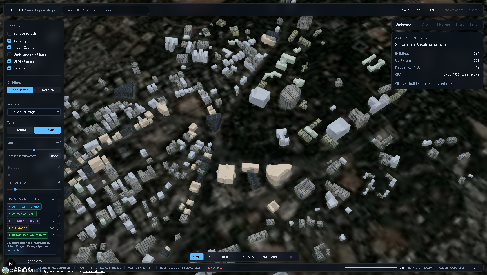
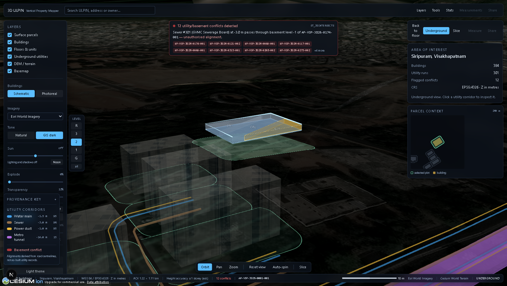

# 3D ULPIN — Vertical Property Mapper

A three-dimensional cadastral viewer for **Siripuram, Visakhapatnam**
(bbox `83.3130,17.7180,83.3245,17.7280`).

Land administration is normally drawn flat, but rights are not flat. This app
models the whole vertical stack — **parcel → building → floor → unit** — plus the
**underground utility corridors** that can legally encroach on a basement, and it
labels every entity with **where its data came from**.

That last part is the point of the system: in this area only **8% of buildings
carry a height in OpenStreetMap**, so almost every storey count on screen is an
inference. A viewer must never be left unsure which numbers were measured and
which were guessed.



---

## Running it

```bash
npm install                # also copies Cesium assets into public/cesium
docker compose up -d       # PostGIS 16 + PostGIS 3.4 + SFCGAL
npm run db:schema          # only if the volume already existed
npm run seed               # fetch OSM -> estimate -> seed -> utilities -> export
npm run dev                # http://localhost:3000
```

**The database is optional at runtime.** The route handlers try PostGIS first
and fall back to the committed snapshots in `data/api/`, so `npm run dev` alone
renders the full app. Every response carries an `x-ulpin-backend:
postgis|snapshot` header saying which path served it.

### Basemap imagery

The basemap is **Esri World Imagery** and needs no key. It is dimmed by a
colour treatment applied to the imagery layer so it reads as context beneath
the buildings rather than competing with them; the buildings themselves are
never dimmed, and the contrast between the two is the point.

Both controls live in the Layers panel under the Basemap checkbox:

| Imagery | Notes |
|---|---|
| Esri World Imagery | Default. No token. |
| Esri Wayback (archive) | Historical mosaics. Needs `WAYBACK_RELEASE` (below). |
| Mapbox Satellite | Hidden unless `NEXT_PUBLIC_MAPBOX_TOKEN` is set. |
| Dark vector (no imagery) | CARTO `dark_all`. Non-photographic, and the fallback. |
| None | No layer at all; bare `#0d1219` globe. Underground mode, clean captures. |

**Tone** switches between `GIS dark` (default) and `Natural` (raw imagery, for
when a reviewer asks to see the source). Switching either control swaps layer 0
in place — the viewer is not rebuilt and the camera does not move.

If a provider fails to load, the app logs a warning and falls back to CARTO;
the StatusBar then shows the effective basemap marked `(fallback)`, so a
degraded map is never silent. The globe is never left untextured.

**Wayback releases** are global snapshots and there is no API for "the best one
over Siripuram". Pick one by hand from the
[Wayback app](https://livingatlas.arcgis.com/wayback) over the AOI and set
`WAYBACK_RELEASE` in `lib/cesium/imagery.ts`. Left `null` (the default), the
Wayback option resolves to current Esri imagery.

Attribution is a licence obligation — Esri, Maxar, CARTO and OSM credits render
bottom-left and must not be hidden. Esri's World Imagery service also carries
its own [terms of use](https://www.arcgis.com/home/item.html?id=10df2279f9684e4a9f6a7f08febac2a9)
for heavy or commercial use.

### Cesium ion token (optional)

A token affects **terrain only** — imagery does not use ion:

```
NEXT_PUBLIC_CESIUM_TOKEN=your_token_here
```

Without one the globe falls back to a flat ellipsoid and says so in a
dismissible notice. The basemap is unaffected, and the app is fully usable
either way.

---

## What is real, and what is not

This distinction is enforced in the data model, not just in the prose.

| Layer | Source | Status |
|---|---|---|
| Building footprints | OpenStreetMap (ODbL) | **Real** |
| Road centrelines | OpenStreetMap (ODbL) | **Real** |
| Storey counts, 8% | `building:levels` / `height` tags | **Real** (`osm_tag`) |
| Storey counts, 90% | area + building-tag heuristic | **Estimated** (`estimated`) |
| Storey counts, 4% | `data/surveyed_plans.json` | **Synthetic demo register** (`surveyed_plan` + `survey_synthetic`) |
| Ground elevation | no DEM supplied → 12.0 m default | **Placeholder** |
| Parcel boundaries | Voronoi plots around clustered footprints | **Derived, not surveyed** |
| Owners, tenure, encumbrances | generated placeholders | **Synthetic** |
| Utility alignments | offsets from road centrelines | **Representative, not as-built** |

`data/surveyed_plans.json` carries a `_synthetic: true` flag, and that flag is
threaded through the `building.survey_synthetic` column all the way to the
DetailPanel, which then renders the provenance badge as **“Surveyed plan
(demo)”**. Fabricated data is never allowed to borrow the authority of a real
survey.

`dsm_dem` provenance is implemented but yields **zero rows**, because no DSM/DEM
raster is supplied. Drop a `data/dem.tif` in and `02_heights.py` will use it.

### The identifier

```
AP-VSP-3D26-<parcel4>-<bldg3>-<floor2>-<unit2>
        e.g. AP-VSP-3D26-0042-007-05-03
```

Right-truncated for coarser entities; floor codes are `00` ground, `01`–`99`
above, `B1`–`B9` basements.

> **This is an unofficial vertical extension of the 14-digit ULPIN
> (Bhu-Aadhaar). It is not an official government identifier**, is not issued by
> or registered with any revenue department, and carries no legal weight.

That sentence is rendered on the ULPIN card in the UI, not hidden in a tooltip.
`lib/ulpin.ts` and `db/02_functions.sql`'s `ulpin_fmt()` implement the same
encoding; their agreement is asserted in `lib/ulpin.test.ts`.

---

## Architecture

```
app/                     layout, page (composition only), 6 API route handlers
components/globe/        CesiumRoot (viewer, imagery, terrain), CameraDirector, Picker, Scene
components/layers/       Parcels, Buildings, FloorStack, Units, Utilities, Conflict
components/ui/           TopBar, LayerPanel, ActionBar, FloorLadder, ElevationRuler,
                         DetailPanel, ParcelInset, NavDock, StatusBar, Legend,
                         ConflictBanner, UlpinCard, Provenance, IonNotice
lib/                     ulpin.ts, store.ts, db.ts, types.ts, cesium/*
db/                      01_schema.sql, 02_functions.sql   (run by initdb)
scripts/                 01-05 pipeline, build_geometry.sql, utilities.sql, verify_ui.mjs
data/                    committed OSM snapshots + data/api/ served when the DB is down
```

Four rules the code actually obeys (and `grep` can confirm):

1. **One store, few writers.** The Zustand view store holds
   `{mode, activeBuildingId, isolatedFloor, selectedUnitId, layers, explodeT,
   theme, underground, …}`. Only `Picker` and the UI controls write to it.
   Layer components read it and render.
2. **All camera motion lives in `CameraDirector`.** No `flyTo`, `zoomTo` or
   `lookAt` exists anywhere else. (`CesiumRoot` performs a single `setView` to
   frame the AOI at construction — the scene's initial pose, not a transition.)
3. **Colours are defined once**, in `lib/cesium/materials.ts`.
4. **Every DetailPanel entity shows a provenance line.**

### Notable implementation decisions

**Metric geometry is built in SQL, not Python.** Python 3.14 has patchy wheels
for `shapely`/`rasterio`, and PostGIS+SFCGAL was already a hard dependency. The
Python scripts do fetch and attribute estimation only — stdlib plus an optional
`rasterio` — while extrusion, unit subdivision, utility offsetting and conflict
detection are SQL. Construction happens in **EPSG:32644** (UTM 44N) and is
transformed back to **4326**; `ST_Transform` leaves Z alone, so stored solids are
lon/lat degrees + height in metres, exactly what Cesium consumes.

**`ST_MakeSolid` is not optional.** `ST_3DIntersects` treats a
`POLYHEDRALSURFACE` as a *shell*, so a point strictly inside a prism does not
intersect it, and a corridor lying wholly within a basement envelope — the worst
kind of encroachment — would go unreported. Both the point query and the
conflict pass promote shells to solids first.

**One animation driver per layer.** `BuildingsLayer` builds its 384 entities
once; hover, fade and hide are `CallbackProperty` closures reading a single
mutable ref, eased by one `requestAnimationFrame` loop rather than 384 tweens.

**Terrain reconciliation.** The DB stores `ground_elev` per spec (12.0 m without
a DEM). Siripuram is hilly, so the viewer samples real terrain under every
building once at load and shifts each stack by the difference. The schema is
untouched; only rendering is reconciled.

**An isolated floor shows the level and its flats together.** The level is drawn
as a thin base plate at its base Z plus a translucent shell over its full height,
and every unit on it stands on that plate as its own solid box — co-visible and
co-pickable, not a drill-down level below.

Two things keep the flats visible, and both are load-bearing. The shell is drawn
at `FLOOR_VIEW.SHELL_ALPHA`, because at full slab thickness a level's volume
*encloses* its own units and wins the depth test. And `Picker` drill-picks and
takes the topmost **unit** if the ray found one, because otherwise the shell in
front of the flats wins the pick ray instead. The plate or shell resolves as the
floor only when no unit is under the cursor — the level's own space, i.e.
corridors and common areas.

Each flat is inset `FLOOR_VIEW.UNIT_INSET_M` from its stored footprint and lifted
`FLOOR_VIEW.UNIT_LIFT_M` off the plate, at render time only. Units are a grid
subdivision, so neighbours share wall lines in the DB; drawn as stored they
z-fight, and in section they merge into one slab. The DB geometry, the API and
the stored ULPINs are untouched. Every distance, alpha and threshold behind this
lives in `FLOOR_VIEW` in `lib/cesium/materials.ts`.

**Slice cuts the rings, not the framebuffer.** Cesium exposes
`ClippingPlaneCollection` on a `Globe`, a `Model` and a `Cesium3DTileset` only —
an entity's `PolygonGraphics` draws through a `Primitive`, which has no
`clippingPlanes` property at all, and every sliceable surface here (plates,
shells, unit volumes, slabs) is entity geometry. So `lib/geo.ts` defines the
half-plane once and `lib/cesium/section.ts` clips the rings against it on the
CPU, feeding the result back through the same `CallbackProperty` mechanism the
rest of the scene animates with. The clip re-runs when the plane moves, not per
frame. Slicing a whole building collapses every level to its plate for the same
reason the isolated floor does, and the architectural model steps aside because
its opaque walls would hide the cut. Slice and Explode are mutually exclusive,
enforced in the store rather than in the two controls.

---

## API

| Endpoint | Returns |
|---|---|
| `GET /api/buildings` | GeoJSON FeatureCollection, all 384 footprints |
| `GET /api/building/:id` | building + floors + units, nested |
| `POST /api/query {lon,lat,z}` | every entity whose 3D volume contains the point, ordered parcel < building < floor < unit |
| `GET /api/utilities` | utility centrelines with depth/radius/authority |
| `GET /api/conflicts` | flagged `ST_3DIntersects` violations |
| `GET /api/parcels` | surface parcels (beyond the brief; the parcels layer and inset need it) |

```console
$ curl -s -X POST localhost:3000/api/query -H 'Content-Type: application/json' \
    -d '{"lon":83.3157,"lat":17.7268,"z":16.7}'

parcel    AP-VSP-3D26-0001            K. Venkata Rao
building  AP-VSP-3D26-0001-001        Water Resourse Block   z 12.00..28.00
floor     AP-VSP-3D26-0001-001-01     Level 1                z 15.20..18.40
unit      AP-VSP-3D26-0001-001-01-01  B01                    z 15.35..18.05
```

---

## The deliberate conflict

`scripts/utilities.sql` routes one sewer straight through a building's basement
and marks it `unauthorised alignment`, so the 3D check has something real to
find. `ST_3DIntersects` reports **12** conflicts in total — the planted one plus
11 genuine incidental encroachments where a service corridor clips a basement.
Underground mode pulses them red and names the planted one first.



---

## Verifying

```bash
npm test           # ULPIN round-trip + SQL-parity assertions
npm run verify:ui  # drives a real Chrome through all five view modes
```

`verify:ui` walks city → building → explode → floor → unit → underground,
asserts the DOM at each step, checks the disabled controls really are disabled,
fails on any console error, and writes screenshots to `docs/shots/`.

Both suites were run against **PostGIS and the snapshot backend**, and the
`POST /api/query` stack is byte-identical between them.

### Current state

- 384 buildings · 325 parcels · 1,810 floors · 6,438 units · 301 utility runs · 12 conflicts
- `npm run build` clean, `tsc --noEmit` clean, 21/21 unit tests, 46/46 UI checks

### Not implemented

**Measurements, Share and Split view** are rendered visibly disabled rather than
hidden, so their absence is explicit rather than implied.

---

## Data licence

Building footprints and road centrelines are © OpenStreetMap contributors,
licensed **ODbL**. Everything derived from them here inherits that licence.
